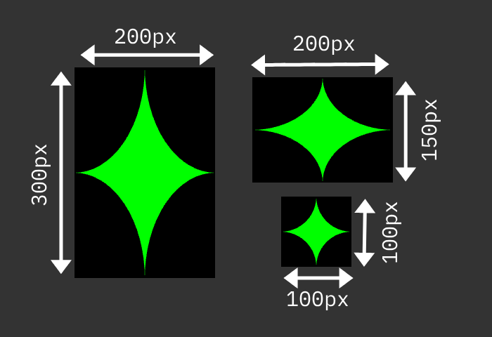

# Stars in their eyes
Your challenge is to return the amount of green pixels in the following image:



He’re is a [JSON dataset](https://devrel.wearedevelopers.com/code100-puzzles/017-stars/stars.json) with the dimensions of each star.

```JSON
[
    { "width": 200, "height": 300 },
    { "width": 200, "height": 150 },
    { "width": 100, "height": 100 }
]
```